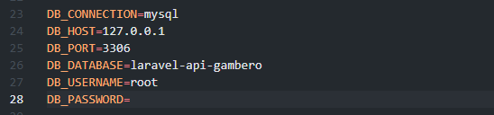
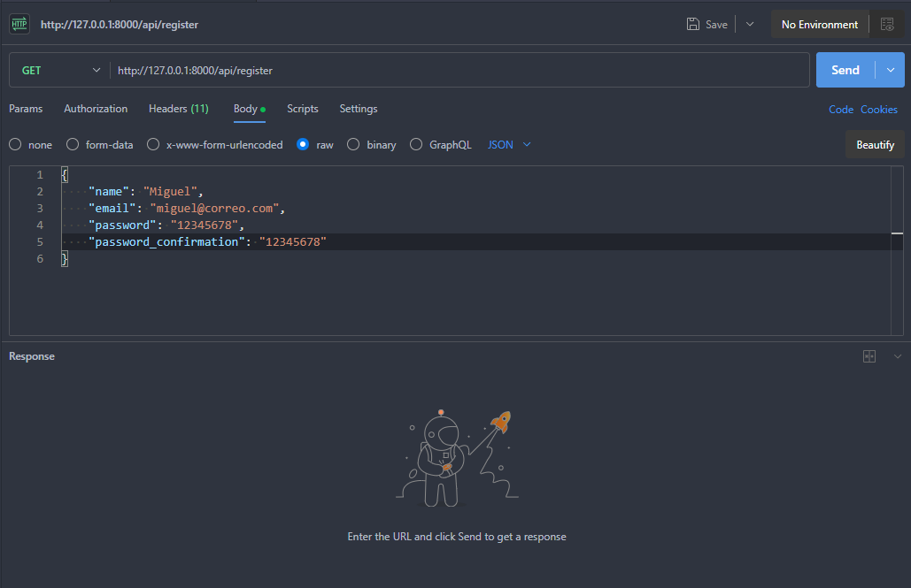
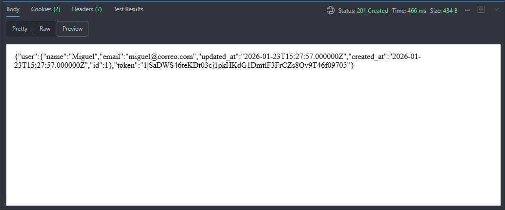
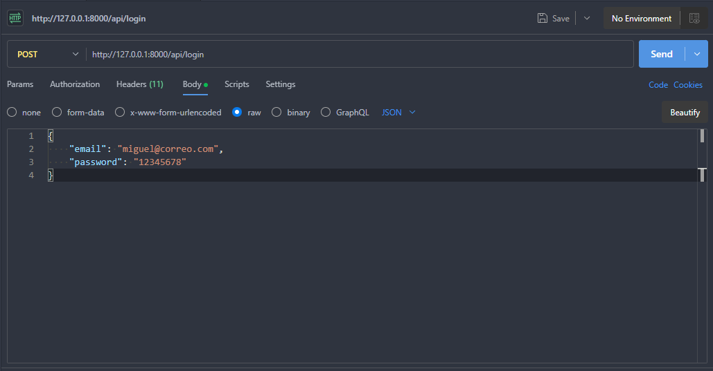
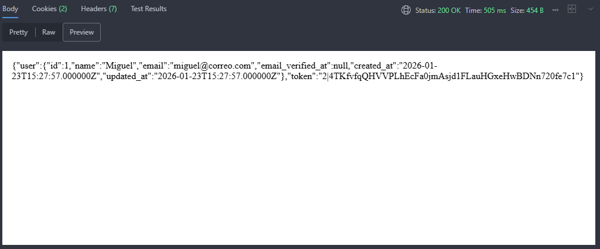
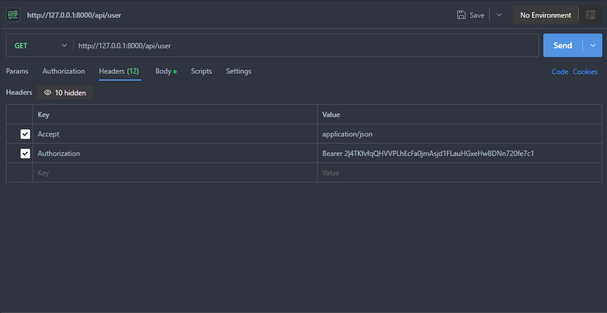
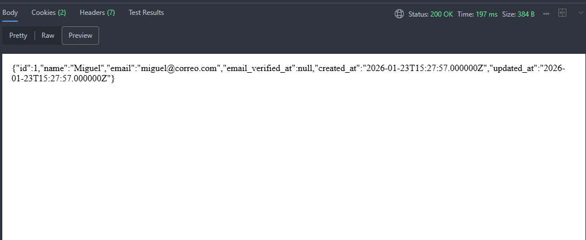

# Laravel API Auth - Sanctum implementation

Este proyecto es una API RESTful desarrollada con **Laravel 11** (o tu versión actual) que implementa un sistema completo de autenticación segura utilizando **Laravel Sanctum**.

El objetivo principal es proporcionar endpoints seguros para el registro de usuarios, inicio de sesión y acceso a rutas protegidas mediante Tokens de Acceso (Bearer Tokens).

## 🚀 Tecnologías

* **Framework:** Laravel
* **Autenticación:** Laravel Sanctum
* **Base de Datos:** MySQL
* **Herramienta de Testing:** Thunder Client (VS Code) / Postman

---

## 🛠️ Instalación y Configuración

Sigue estos pasos para desplegar el proyecto en tu máquina local:

1.  **Clonar el repositorio**
    ```bash
    git clone https://github.com/XanKeeTee/laravel-api-gambero
    cd laravel-api-restfull
    ```

2.  **Instalar dependencias de PHP**
    ```bash
    composer install
    ```

3.  **Configurar el entorno**
    Duplica el archivo de ejemplo y genera la clave de la aplicación:
    ```bash
    cp .env.example .env
    php artisan key:generate
    ```
    *Asegúrate de configurar tus credenciales de base de datos (DB_DATABASE, DB_USERNAME, etc.) dentro del archivo `.env`.*
    !

5.  **Ejecutar migraciones**
    Crea las tablas en la base de datos:
    ```bash
    php artisan migrate
    ```

6.  **Iniciar el servidor local**
    ```bash
    php artisan serve
    ```
    La API estará disponible en: `http://127.0.0.1:8000`

---

## 📡 Endpoints y Pruebas

A continuación se detalla el flujo de autenticación probado.

### 1. Registro de Usuario (`POST`)
**Endpoint:** `/api/register`

Se envían los datos del usuario (nombre, email, contraseña y confirmación). La API valida los datos, crea el usuario y devuelve un token inicial.

* **Request (Body JSON):**
    

* **Response (201 Created):**
    

---

### 2. Inicio de Sesión (`POST`)
**Endpoint:** `/api/login`

El usuario envía sus credenciales. Si son correctas, el sistema devuelve un **token de texto plano** que debe ser usado para futuras peticiones.

* **Request (Body JSON):**
    

* **Response (200 OK - Con Token):**
    

---

### 3. Ruta Protegida - Perfil de Usuario (`GET`)
**Endpoint:** `/api/user`

Esta ruta está protegida por el middleware `auth:sanctum`. Para acceder, es obligatorio enviar el token obtenido en el login dentro de las cabeceras (Headers).

* **Configuración del Header:**
    * `Accept`: `application/json`
    * `Authorization`: `Bearer <TU_TOKEN>`

    

* **Response (Datos del Usuario):**
    Si el token es válido, la API permite el acceso a la información.
    

---
