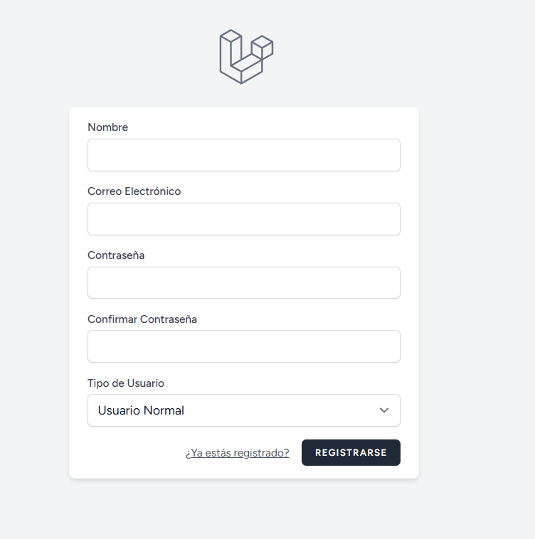
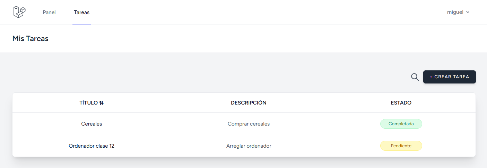
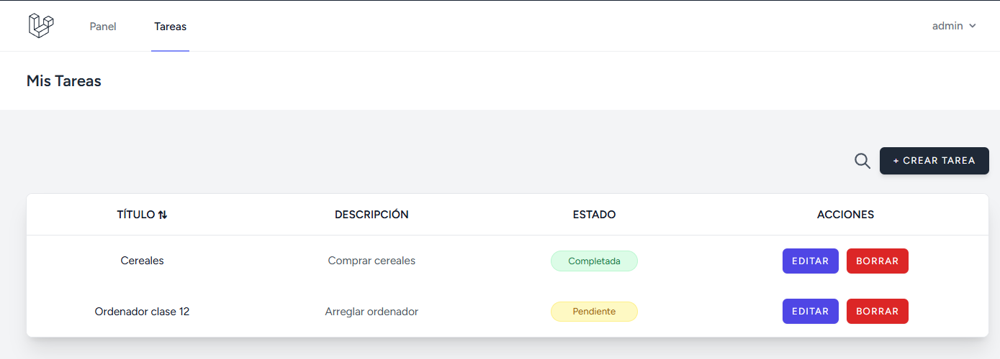

# 🦐 Laravel CRUD Gambero - Gestor de Tareas


Una aplicación web robusta para la gestión de tareas desarrollada con **Laravel 11**. Este proyecto implementa un sistema completo de autenticación con **roles diferenciados (Administrador y Usuario)**, permitiendo un control granular sobre quién puede crear, ver y eliminar tareas.

---

## 📸 Vistazo al Proyecto

### 1. Registro con Roles
El sistema permite a los nuevos usuarios registrarse eligiendo su rol. Esto define sus permisos dentro de la aplicación desde el primer momento.

> 
> *(Captura del formulario de registro con el selector de "Tipo de Usuario" desplegado)*

### 2. Panel de Control (Vista de Usuario)
Los usuarios normales tienen una interfaz limpia donde solo pueden gestionar sus propias tareas. Se ha optimizado la experiencia de usuario ocultando botones de acciones masivas o administrativas.

> 
> *(Captura del Index de tareas logueado como Usuario Normal - SIN botones de borrar/editar)*

### 3. Panel de Administración
Los administradores tienen control total. Pueden visualizar todas las tareas de la plataforma y tienen acceso exclusivo a las acciones de edición y eliminación global.

> 
> *(Captura del Index de tareas logueado como Admin - CON la columna de acciones visible)*

---

## 🚀 Características Principales

* **Autenticación Segura:** Sistema de login y registro protegido utilizando Laravel Breeze.
* **Sistema de Roles (RBAC):**
    * **Administrador:** Acceso global, capacidad de moderación (Borrar/Editar cualquier tarea).
    * **Usuario Estándar:** Acceso privado, solo visualiza y crea sus propias tareas.
* **Gestión de Tareas (CRUD):** Funcionalidad completa para Crear, Leer, Actualizar y Eliminar tareas.
* **Interfaz Reactiva:** Diseño moderno, limpio y responsive utilizando **Tailwind CSS**.
* **Validaciones:** Protección de datos tanto en frontend como en backend para asegurar la integridad de la información.

---

## 🛠️ Requisitos del Sistema

Asegúrate de tener instalado lo siguiente en tu entorno local antes de comenzar:

* [PHP](https://www.php.net/) >= 8.2
* [Composer](https://getcomposer.org/)
* [Node.js](https://nodejs.org/) & NPM
* Base de datos (MySQL, SQLite, o MariaDB)

---

## 💻 Guía de Instalación

Sigue estos pasos para desplegar el proyecto en tu máquina local:

### 1. Clonar el Repositorio
```bash
git clone [https://github.com/tu-usuario/laravel-crud-gambero.git](https://github.com/tu-usuario/laravel-crud-gambero.git)
cd laravel-crud-gambero
```

### 2. Instalar Dependencias de Backend
```bash
composer install                            
```
### 3. Instalar Dependencias de Frontend
```bash
npm install                           
```
### 4. Configurar el Entorno
Duplica el archivo de ejemplo para crear tu configuración local:
```bash
cp .env.example .env                         
```
Abre el archivo .env y configura las credenciales de tu base de datos:

DB_CONNECTION=mysql<br>
DB_HOST=127.0.0.1<br>
DB_PORT=3306<br>
DB_DATABASE=login-crud-gambero<br>
DB_USERNAME=tu_usuario<br>
DB_PASSWORD=tu_contraseña<br>

### 5. Generar Clave de Aplicación
```bash
php artisan key:generate                           
```

### 6. Migrar la Base de Datos
Esto creará las tablas necesarias (Users, Tasks, etc.) y añadirá la columna de roles.
```bash
php artisan migrate                     
```

### 7. Compilar Assets y Ejecutar
Necesitarás dos terminales abiertas:
## Terminal 1 (Compilación de estilos en tiempo real):
```bash
npm run dev                      
```
## Terminal 2 (Ejecución del servidor):

```bash
php artisan serve
```

¡Listo! Accede a http://localhost:8000 en tu navegador.